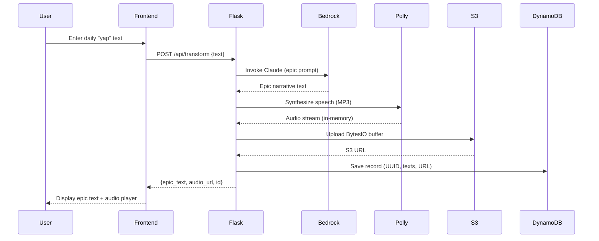

# Yap-to-Tale — Complete Codebase Walkthrough

## Overview
Built a production-ready, stateless microservice that transforms mundane user text into epic, dramatic narratives using AWS Generative AI services.

## Files Created (7 total)

### Backend
| File | Purpose |
|------|---------|
| [app.py](file:///d:/projects/Yap-To-Tale/app/app.py) | Flask application with `/api/transform` pipeline: Bedrock → Polly → S3 → DynamoDB |
| [requirements.txt](file:///d:/projects/Yap-To-Tale/requirements.txt) | Python dependencies (Flask, gunicorn, boto3, flask-cors) |

### Frontend
| File | Purpose |
|------|---------|
| [index.html](file:///d:/projects/Yap-To-Tale/app/static/index.html) | Dark-mode SPA with textarea, submit button, results container, and audio player |
| [style.css](file:///d:/projects/Yap-To-Tale/app/static/style.css) | Design system with glassmorphism, animated particles, micro-animations, responsive layout |
| [app.js](file:///d:/projects/Yap-To-Tale/app/static/app.js) | Frontend logic — validation, fetch API, loading states, Ctrl+Enter shortcut |

### Infrastructure
| File | Purpose |
|------|---------|
| [Dockerfile](file:///d:/projects/Yap-To-Tale/Dockerfile) | `python:3.12-slim` image, non-root user, gunicorn, health check |
| [deployment.yaml](file:///d:/projects/Yap-To-Tale/k8s/deployment.yaml) | 3-replica Deployment with resource limits, probes, env vars |
| [service.yaml](file:///d:/projects/Yap-To-Tale/k8s/service.yaml) | LoadBalancer Service routing port 80 → 5000 |

## Architecture Flow

## Key Design Decisions

- **Stateless**: All audio handled via `io.BytesIO` — zero disk writes
- **Non-root container**: Security best practice with dedicated `appuser`
- **Gunicorn**: 4 workers, 120s timeout for long Bedrock/Polly calls
- **Rolling updates**: `maxUnavailable: 0` for zero-downtime deployments
- **Glassmorphism UI**: Dark mode with animated particles, CSS custom properties, responsive design
- **Accessibility**: ARIA labels, `prefers-reduced-motion`, semantic HTML

## AWS Prerequisites
Before deploying, you need to set up:
1. **S3 Bucket** named `yap-to-tale-audio-bucket` (or update the env var)
2. **DynamoDB Table** named `yap-to-tale-records` with partition key `id` (String)
3. **Bedrock Model Access** — enable Claude 3 Sonnet in your AWS region
4. **IAM Permissions** for the EKS service account / EC2 instance profile covering `bedrock:InvokeModel`, `polly:SynthesizeSpeech`, `s3:PutObject`, `dynamodb:PutItem`
